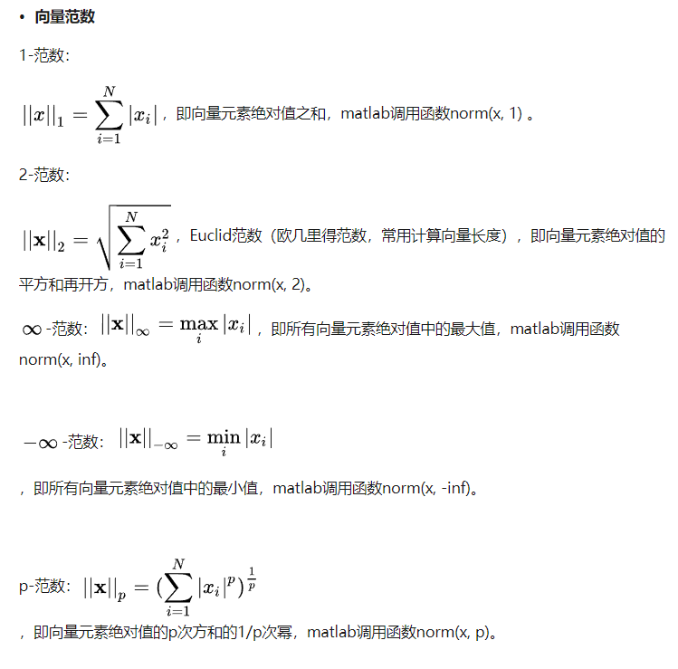
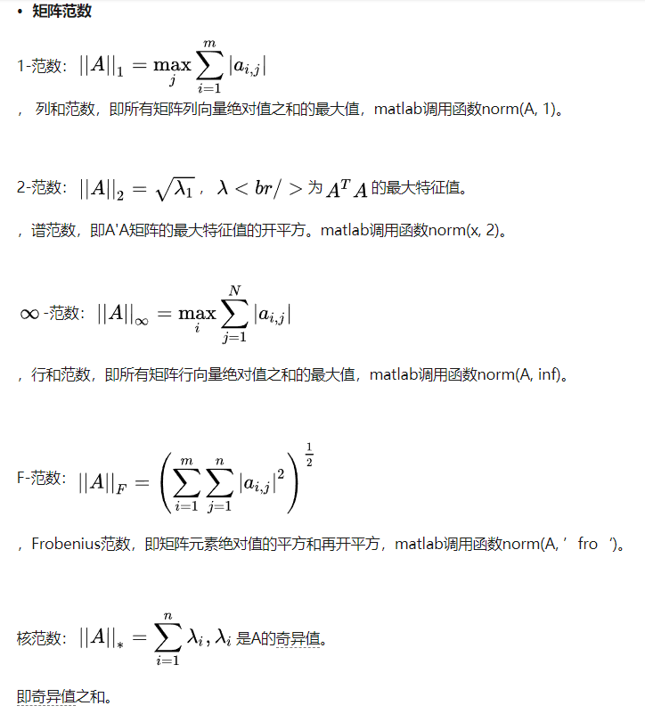

# 第二章 线性代数

## 参考

1. P10 fukushima 新认知机 受哺乳动物视觉系统结构启发-> 处理图片的模型. -> CNN 的基础 

	https://link.springer.com/article/10.1007/BF00342633

## 知识路线

### 一. 向量空间

- [x] 向量空间 vector space
- [x] 子空间 subspace
- [x] 最小子空间 
- [x] 直和 direct sum

## 二. 有限维向量空间

- [x] 线性组合 linear combination
- [x] 张成空间 span 
  - [x] 张成空间是包含这组向量的最小子空间
- [x] 有限维向量空间 finite-dimensional vector space
- [x] 多项式 polynomial

## 六. 内积空间

- [x] 范数
- [ ] 

