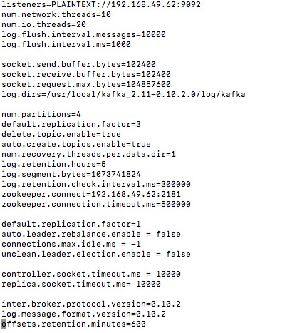

# learn

## Java

### @RequestHeader的作用

http://blog.csdn.net/yhjyumi/article/details/48105331

### produces/consumes在@requestMapping中的使用方式和作用

1. ```produces="application/json"```


	```
    @GetMapping(path = "/titles/{titleid}", produces = MediaType.APPLICATION_JSON_VALUE+";charset=utf-8;")
	```

2. ```consumes="application/json"```

### inner join

```
SELECT * FROM title_option as t1 inner join title on t1.title_id = title.id where title.type_id =1;
```


```
    @OneToOne(fetch = FetchType.EAGER,
            cascade = CascadeType.ALL,
            mappedBy = "user")
    private UserProfile userProfile;

    @OneToOne(fetch = FetchType.LAZY)
    @JoinColumn(name = "user_id", nullable = false)
    private User user;
```

在profile的表中会多出现一个字段 ```user_id```


```
Hibernate: select user0_.id as id1_4_0_, user0_.email as email2_4_0_, user0_.first_name as first_na3_4_0_, user0_.last_name as last_nam4_4_0_, user0_.password as password5_4_0_, userprofil1_.id as id1_3_1_, userprofil1_.address1 as address2_3_1_, userprofil1_.address2 as address3_3_1_, userprofil1_.city as city4_3_1_, userprofil1_.country as country5_3_1_, userprofil1_.dob as dob6_3_1_, userprofil1_.gender as gender7_3_1_, userprofil1_.phone_number as phone_nu8_3_1_, userprofil1_.state as state9_3_1_, userprofil1_.street as street10_3_1_, userprofil1_.user_id as user_id12_3_1_, userprofil1_.zip_code as zip_cod11_3_1_ 

from users user0_ left outer join user_profiles userprofil1_ 
on user0_.id=userprofil1_.user_id 
where user0_.id=?

```


[参考](http://blog.csdn.net/JE_GE/article/category/6528500)


https://www.callicoder.com/hibernate-spring-boot-jpa-one-to-one-mapping-example/

https://www.callicoder.com/hibernate-spring-boot-jpa-one-to-many-mapping-example/

关于fetchType

https://howtoprogramwithjava.com/hibernate-eager-vs-lazy-fetch-type/


- orphanRemoval:如：一级分类删除，是否自动删除和该一级分类外键的二级分类及关联的商品对象，true代表自动删除
- fetch:加载策略，如懒加载，因功能需要设置，如果我们需要查询一级分类的时候就把二级分类查出来，就不用懒加载

### java.lang.StackOverflowError

级联循环...然后堆栈溢出

### 


### mysql 常用配置

```
spring:
  datasource:
    url: jdbc:mysql://localhost:3306/mydb2?useSSL=false
    username: root
    password: admin
    driver-class-name: com.mysql.jdbc.Driver
  jpa:
      database: MYSQL
      properties:
        hibernate:
          format_sql: true
          show_sql: true
          hbm2ddl:
            auto: update
logging:
  level:
    org:
      hibernate:
        SQL: DEBUG
        type: TRACE

```


### lazy load 异常

If you would like to keep Lazy Load and you are using Spring Boot, just add the config below in your application.properties:

```
spring.jpa.properties.hibernate.enable_lazy_load_no_trans=true
```

### @lob


### 多外键问题

PropertyReferenceException: No property typeId found for type Title! 

可能是由于repository 初始化的问题


### how to order join fetch

@OrderBy("optionOrder asc ")

https://stackoverflow.com/questions/5903774/ordering-a-join-fetched-collection-in-jpa-using-jpql-hql

### how to rename json objectsvariables name in springboot

https://stackoverflow.com/questions/38635472/how-to-rename-json-objectsvariables-name-in-spring-boot

```@JsonProperty("type_id")```


### update

TODO:

1. 查询更新
2. 使用@query, @modify,update...

### how to convert page to list 

```
Page<Video> videos = videoRepository.findAllVideos(new PageRequest(1, 50));
List<Video> videosList = videos.getContent();
```

### how to get page count

```
Page<Industry> industries = industryRepository.findAll(pageable);
int totalPages = industries.getTotalPages();
```

### mysql 跳过

```
SELECT * FROM foo LIMIT 10, 50
```

### java调用 C

TODO:

### Spring MVC 中 HandlerInterceptorAdapter的使用


### 验证 属性

@vaild bindresult

```
if (bindingResult.hasErrors()) {
            return RetObj.fail(bindingResult.getFieldError().getDefaultMessage());
        }
```

### caching is not working in spring interceptor

另外添加到一个service中

### interceptor 返回false

可以设置```contentType```,返回json:

```
response.getWriter()
          .print()
```

### right join

```
SELECT a.`nickname`,b.view_wx_id,b.countBless  FROM  `act_wxuser` as a RIGHT JOIN (SELECT view_wx_id ,COUNT(*) as countBless FROM `vcare`.`act_bless`  GROUP BY  view_wx_id ) as b on a.`id` = b.view_wx_id  order by b.countBless;
```

### postman mockserver

postman mockserver  用来测试api，大量(并发)

### 登录 linux

ssh -l root -p 22 ip地址

### commons 常用配置

```
<dependency>
  <groupId>org.apache.commons</groupId>
  <artifactId>commons-lang3</artifactId>
</dependency>
<dependency>
  <groupId>commons-collections</groupId>
  <artifactId>commons-collections</artifactId>
</dependency>
```

### hibernate - java8 

```
<dependency>  
    <groupId>org.hibernate</groupId>  
    <artifactId>hibernate-java8</artifactId>  
    <version>5.1.2.Final</version>  
</dependency>  
```

### dozer bean转化

支持 localdatetime

```
<dependency>
    <groupId>io.craftsman</groupId>
    <artifactId>dozer-jdk8-support</artifactId>
    <version>1.0.2</version>
</dependency>
```


### RequestRaram 参数验证

1. controller 加上```@Validated```注解

```
@RestController
@Validated
public class UserController {

  ... 
}
```

2. 在参数中加上验证注解

比如: ```@NotBlank``` ,```@Size```,```@Length```

```
  @PostMapping(path = "user/login")
  public RetObj loginIn(@NotBlank(message = "用户名不能为空") @RequestParam(value = "username") String userName,
                        @NotBlank(message = "密码不能为空") @RequestParam(value = "password") String password) {

}
```


3. 配置全局异常捕获

```
@ControllerAdvice
@Component
public class GlobalExceptionHander {

    @ExceptionHandler
    @ResponseBody
    @ResponseStatus(HttpStatus.BAD_REQUEST)
    public RetObj paramErrorHandler(ConstraintViolationException exception) {
        Set<ConstraintViolation<?>> violations = exception.getConstraintViolations();
        StringBuilder strBuilder = new StringBuilder();
        for (ConstraintViolation<?> violation : violations ) {
            strBuilder.append(violation.getMessage()).append(";");
        }
        return RetObj.fail(strBuilder.toString());
    }

    @ExceptionHandler(value = Exception.class)
    @ResponseBody
    @ResponseStatus(HttpStatus.BAD_REQUEST)
    public RetObj jsonErrorHandler(HttpServletRequest req, Exception e) {
        return RetObj.fail("服务器内部错误");
    }
}

```

4. 这步还没有验证要不要做

```
@Configuration
public class ValidationConfig {

    @Bean
    public MethodValidationPostProcessor methodValidationPostProcessor() {
        return new MethodValidationPostProcessor();
    }
}
```


### cacheput 中 使用unless

```
@Cacheable(value = "snoreUser",key = "'snore_user_'+#username",unless = "#result == null")
public User findUserByUsername(String username) {
    return userRepository.findByUserName(username);
}
```

###  排序

```
Pageable pageable = new PageRequest(page - 1, pageSize, new Sort(new Sort.Order(Sort.Direction.DESC, "reportStartTime")));
```

### 分页缓存

TODO:

### redis 缓存 LocalDate/LocalDateTime

config 


```
server:
  port: 8801

spring:
  datasource:
    url: jdbc:mysql://localhost:3306/snore?useUnicode=true&characterEncoding=utf8&autoReconnect=true&failOverReadOnly=false&useSSL=false
    username: root
    password: 
    driver-class-name: com.mysql.jdbc.Driver
  jpa:
      database: MYSQL
      properties:
        hibernate:
          format_sql: false
          show_sql: true
          dialect: org.hibernate.dialect.MySQL5Dialect
          hbm2ddl:
            auto: none
  redis:
    database: 8
    host: 
    password: 
    pool:
      max-active: 1000
      max-idle: 20
      max-wait: -1
      min-idle: 5
    port: 6379
    timeout: 0

```

### @RequestParam 接受localdatetime

参考: [Spring Boot LocalDateTime格式处理](http://blog.csdn.net/junlovejava/article/details/78112240)

```
@GetMapping("date")
public Object date(@RequestParam @DateTimeFormat(pattern = "yyyy-MM-dd HH:mm:ss") LocalDateTime date) {
    return date;
}
```

### 设置 jackson bean 改变 responseBody 

### redis 序列化错误

```
Could not read JSON: Can not construct instance of com.xxx.xxx.controller.TestObj: no suitable constructor found, can not deserialize from Object value (missing default constructor or creator, or perhaps need to add/enable type information?)
```

解决:

1. 在序列化的对象中,需要加入无参构造器
2. 其他配置

```
@Bean
  public RedisTemplate<Object, Object> redisTemplate(RedisConnectionFactory factory) {
      RedisTemplate<Object, Object> template = new RedisTemplate<>();
      template.setConnectionFactory(factory);

      Jackson2JsonRedisSerializer<Object> jackson2JsonRedisSerializer = new Jackson2JsonRedisSerializer<Object>(
              Object.class);
      ObjectMapper om = new ObjectMapper();
      om.setVisibility(PropertyAccessor.ALL, JsonAutoDetect.Visibility.ANY);
      om.enableDefaultTyping(ObjectMapper.DefaultTyping.NON_FINAL);

      om.registerModule(new ParameterNamesModule())
              .registerModule(new Jdk8Module())
              .registerModule(new JavaTimeModule()); // new module, NOT JSR310Module
      om.findAndRegisterModules();

      om.configure(SerializationFeature.WRITE_DATES_AS_TIMESTAMPS, false);

      jackson2JsonRedisSerializer.setObjectMapper(om);

      template.setKeySerializer(new GenericToStringSerializer<>(Object.class));
      template.setHashKeySerializer(new GenericToStringSerializer<>(Object.class));

      template.setValueSerializer(jackson2JsonRedisSerializer);

      template.afterPropertiesSet();
      return template;
  }
```


### 数据库使用 localdatetime  精度丢失

mysql 中使用 datetime(3) 或者 timestamp(3),精确到秒后3位

@Convert(converter = Jsr310JpaConverters.LocalDateTimeConverter.class)

### 多线程处理


1. 配置线程池

```
@Configuration
public class ThreadPoolConfig {

    @Bean
    public ExecutorService getThreadPool() {
        // return Executors.newFixedThreadPool(5);
        return Executors.newCachedThreadPool();
    }
}

```

2. 使用```ExecutorService```

  ```
  @Autowired
  private ExecutorService executorService;

  public void test(){

    executorService.execute(() -> {
                //更新
                testService.update();
            });
  }
  ```

注意: 在高并发情况下会出问题,重复写

### 部署

1、mvn clean
2、mvn -f prod_pom.xml package
3、scp target/snore-0.0.1-SNAPSHOT.war root@192.2.1.109:/project/2018/mar/snore/snore.jar

### Spring Data Redis - Could not safely identify store assignment for repository candidate interface com.proton.snoreorigin.dao.UserSessionRepository.


### left join ,  group by 

```
select u.id,u.realname,u.created,reportCount,model from ecg.v_user as u 
left join ecg.v_session as s on s.uid = u.id 
left join (
  select count(*) as reportCount ,r.creator as u1 from ecg.u_report as r group by r.creator 
) as result1  on result1.u1 = s.uid
where  u.realname like '%%' and u.mobile like '%15%' and u.created > '2018-1-1' and u.created < '2018-3-1'
    and s.model like '%iPhone%'
order by u.created desc limit 1,10;
```

```
select * from ecg.v_user as u 
left join (select count(*) as c1 ,r.creator as u1 from ecg.u_report as r group by r.creator ) as result1 
on result1.u1 = u.id 
where mobile like "%1%"; 
```

spring data jpa 1.9

Cannot use native queries with dynamic sorting and/or pagination in method

```
@Query(value = "select u.id,u.realname,u.created,reportCount,model from ecg.v_user as u \n" +
      "left join ecg.v_session as s on s.uid = u.id \n" +
      "left join (\n" +
      "select count(*) as reportCount ,r.creator as u1 from ecg.u_report as r group by r.creator \n" +
      ") as result1  on result1.u1 = s.uid\n" +
      "where  u.realname like %:realname% and u.mobile like %:mobile% and u.created > :startTime and u.created < :endTime \n" +
      "and s.model like '%iPhone%' limit :sindex,:eindex;")
  List<Object[]> findCustom(@Param("realname")String realname,
                   @Param("mobile")String mobile,
                   @Param("startTime")Date startTime,
                   @Param("endTime")Date endTime,
                @Param("sindex")int start,
                @Param("eindex")int end
                  );
```

### kafka java

```
spring:
  kafka:
    consumer:
      bootstrap-servers: 47.97.199.139:9092,47.97.199.139:9093,47.97.199.139:9094
      group-id: 1
      client-id: 1
    producer:
      bootstrap-servers: 47.97.199.139:9092,47.97.199.139:9093,47.97.199.139:9094
      key-serializer: org.apache.kafka.common.serialization.IntegerDeserializer
      value-serializer: org.apache.kafka.common.serialization.StringDeserializer
```


### java string

与 bytes 转化

### kafka 管理

####  zkUtils 操作

https://www.cnblogs.com/huxi2b/p/6592862.html

#### adminClient 操作

adminClient

http://kafka.apache.org/10/javadoc/org/apache/kafka/clients/admin/KafkaAdminClient.html

## 启动

docker run -d -p 8001:8080 -v /data/vcare-test:/usr/local/tomcat/webapps -v /etc/localtime:/etc/localtime:ro -v /etc/timezone:/etc/timezone --name vcare_test tomcat:8-jre8


## 服务器配置



## spring bean 与 线程安全

http://www.importnew.com/27440.html

## gradle 

jcenter

发布jar

## 将一个流分成多个流

kafka streams branch


curl -v --basic -u proton:proton123 -k http://localhost:8080/api/v2/nodes/emq@127.0.0.1/clients

## emqttd dashboard 

https://github.com/emqtt/emq-dashboard/issues/215

## Collection removeIf

ConcurrentModificationException

Collection 默认方法

```
default boolean removeIf(Predicate<? super E> filter) {
        Objects.requireNonNull(filter);
        boolean removed = false;
        final Iterator<E> each = iterator();
        while (each.hasNext()) {
            if (filter.test(each.next())) {
                each.remove();
                removed = true;
            }
        }
        return removed;
    }
```

## Spliterator

https://segmentfault.com/q/1010000007087438

stream 流迭代器

## 二维数组

```
String[][] keys = new String[][]{
            new String[]{"rt", "sn"},
            new String[]{"bat", "sn"},
            new String[]{"ht", "time", "sn"}
    };
String[] s = keys[1];
System.out.println(ArrayUtils.toString(s));

```

## kafka 集群连接不上 其他node

```
 WARN [Controller id=1, targetBrokerId=2] Connection to node 2 could not be established. Broker may not be available. (org.apache.kafka.clients.NetworkClient)
```

由于 node 2的```advertised.host.name```写错了.所以 zookeeper 连接上了,但是kafka broker 却搜索不到

## Error Path:/config/brokers Error:KeeperErrorCode = NodeExists for /config/brokers

2888,3888 端口未打开


## mkdir  

多级目录

mkdir -p data/2018/april/

## vim 查找

我们通常在vim下要查找字符串的时候， 都是输入 / 或者 ？  加 需要查找的字符串来进行搜索，比如想搜索 super 这个单词， 可以输入  /super  或者  ？super，  两者的区别是前者是从上往下搜索，后者是从下往上搜索。

      那么如果我想搜索本行中某个单词，并且这个单词很长的时候， 手动输入该字符串是非常麻烦的， 当然可以使用模糊匹配(如* 或 ？)来做， 不过这样可能搜得到很多其他的，不完全匹配的字符串。

      可以使用如下方式来实现快速查找：

1， 最快的方式是让光标停留在想要查找的单词的任意一个字母上面， 然后输入Shift + *  ，即可快速选中该单词，并且可以通过 n  或  N 进行上一个或下一个的匹配。


## mirror

```
<mirror>
        <id>nexus-aliyun</id>
        <mirrorOf>central</mirrorOf>
        <name>Nexus aliyun</name>
        <url>http://maven.aliyun.com/nexus/content/groups/public</url>
</mirror>
```

## shell exec

https://www.cnblogs.com/yjf512/p/6492746.html

exec是用新的进程去代替原先的进程，原先的进程就消失了。

## vim 显示行号

```:set nu```

```:set number```

## 接口的静态方法

接口的静态方法,不能继承

https://www.zhihu.com/question/36734911

## java 重载

1. java语言中,重载除了要和原方法具有相同的简单名称之外,还要求必须有一个和原方法不同的特征签名.
2. 特征签名就是一个方法中各个参数在常量池中的字段符号引用的集合,而且返回值并不会包含在特征签名中,即java中无法依靠返回值的不同来进行重载.
3. 但是在class文件中,特征签名的范围更大一些, 两个方法拥有相同的名称和特征签名,但是返回值不同,也是可以共存在一个Class文件中的.

## exception handler

```

@RestControllerAdvice
public class ErrorHandler {

    //参数缺失
    @ExceptionHandler(MissingServletRequestParameterException.class)
    public ReturnObject missingServletRequestParameter(MissingServletRequestParameterException ex) {
        return ReturnObject.fail("param - " + ex.getParameterName() + " is missing");
    }

    //参数类型转换错误
    @ExceptionHandler(MethodArgumentTypeMismatchException.class)
    public ReturnObject methodArgumentTypeMismatch(MethodArgumentTypeMismatchException ex) {
        return ReturnObject.fail("param - " + ex.getName() + " type error");
    }

    @ExceptionHandler(HttpRequestMethodNotSupportedException.class)
    public ReturnObject httpRequestMethodNotSupportedException(HttpRequestMethodNotSupportedException ex) {
        return ReturnObject.fail("http method error");
    }

    @ExceptionHandler(NoHandlerFoundException.class)
    public ReturnObject noHandlerFoundException(NoHandlerFoundException ex) {
        String requestURL = ex.getRequestURL();
        return ReturnObject.fail(requestURL + " - " + ex.getHttpMethod() + " not found");
    }

    @ExceptionHandler(Exception.class)
    public ReturnObject exceptionHandler() {
        return ReturnObject.fail("server error -.-");
    }

}
```

## Spring Boot Remove Whitelabel Error Page

```
@RestController
@RequestMapping("/error")
public class CustomErrorController implements ErrorController {

    @GetMapping
    public ReturnObject getError() {
        return ReturnObject.fail("你可能走到了一个死胡同 (╥╯^╰╥)");
    }

    @Override
    public String getErrorPath() {
        return "/error";
    }
}
```


### curl basic auth

```
curl http://xxxxx -u user:password
```


### vim 添加一行

按大写的G 跳到最后一行。 然后按小写的字母o键，增加一行。

### 磁盘占用

```df -h```

```df -hl```

### 查找文件

```
find / -name emqtt_bench_pub 
```

### javap

```
javap -verbose Hello
```

### long++ int++

```
public long test1(long x){
  return x++;
}

public long test1(long);
  descriptor: (J)J
  flags: ACC_PUBLIC
  Code:
    stack=6, locals=3, args_size=2
       0: lload_1
       1: dup2
       2: lconst_1
       3: ladd
       4: lstore_1
       5: lreturn
    LineNumberTable:
      line 23: 0

```

```
public int test2(int x){
      return x++;
}

public int test2(int);
  descriptor: (I)I
  flags: ACC_PUBLIC
  Code:
    stack=1, locals=2, args_size=2
       0: iload_1
       1: iinc          1, 1
       4: ireturn
    LineNumberTable:
      line 27: 0

```


## 博客

https://hexo.io/

## 查看端口占用 port

```lsof -i:80```

```netstat -tunlp```

## 查看 pid 的工作目录

```lsof -p pid```

## dokuwiki 

```
./lampp reloadapache

```

## 内联样式

```
<meta http-equiv="Content-Security-Policy" content="default-src *; style-src 'self' 'unsafe-inline'; script-src 'self' 'unsafe-inline' 'unsafe-eval' http://cdnjs.cloudflare.com ">
```


## HikariPool

史上最快的数据库连接池

```
# jdbc_config   datasource
spring.datasource.driver-class-name=com.mysql.jdbc.Driver
spring.datasource.url=jdbc:mysql://127.0.0.1:3306/datebook?useUnicode=true&characterEncoding=UTF-8&autoReconnect=true&useSSL=false&zeroDateTimeBehavior=convertToNull
spring.datasource.username=root
spring.datasource.password=root

# Hikari will use the above plus the following to setup connection pooling
spring.datasource.type=com.zaxxer.hikari.HikariDataSource
spring.datasource.hikari.minimum-idle=5
spring.datasource.hikari.maximum-pool-size=15
spring.datasource.hikari.auto-commit=true
spring.datasource.hikari.idle-timeout=30000
spring.datasource.hikari.pool-name=DatebookHikariCP
spring.datasource.hikari.max-lifetime=1800000
spring.datasource.hikari.connection-timeout=30000
spring.datasource.hikari.connection-test-query=SELECT 1
```

### redis 删除指定前缀的key

```
./redis-cli KEYS "Device_3102*" | xargs ./redis-cli DEL
redis-cli KEYS "Device_1" | xargs redis-cli get

```

## 集合类详解


http://www.cnblogs.com/lighten/default.html?page=3

## 关于CMS、G1垃圾回收器

https://www.zhihu.com/question/37028283/answer/78008095

## vpn

```
docker run \
    --name ipsec2 \
    --env-file ./vpn.env \
    --restart=always \
    -p 500:500/udp \
    -p 4500:4500/udp \
    -v /lib/modules:/lib/modules:ro \
    -d --privileged \
    hwdsl2/ipsec-vpn-server
```

```
docker run \
    --name ipsec3 \
    --env-file ./vpn.env \
    --restart=always \
    -p 500:500/udp \
    -p 4500:4500/udp \
    -v /lib/modules:/lib/modules:ro \
    -d --privileged \
    hwdsl2/ipsec-vpn-server
```

## interceptor 中返回 json

```
response.setContentType("application/json;charset=utf-8");
RetObj returnObject = new RetObj("FAIL", "哈哈哈哈哈哈哈");
response.getWriter().print(JSON.toJSONString(returnObject));
return false;
```

## mysql 自增

```
AUTO_INCREMENT=10000
```

## 关于 redis-cli auth 成功 -a 失败

```
redis-cli -a "mypassword" KEYS "key*"
```

一直提示 ```(error) NOAUTH Authentication required.```

但我确定我的密码是正确的, 直接 ```redis-cli``` 然后 ```auth "mypassword"``` 是可以操作的.

我感觉我的操作都是正确的, 但不知道为什么验证失败.

后来我在 stackoverflow 上找到一篇

  - https://stackoverflow.com/questions/35745481/redis-cli-with-password

它上面说的是密码中包含 ```$``` 会验证失败,可以修改密码去掉```$```,或者可以使用单引号.

虽然我的密码中,并没有包含```$```,但我也去尝试了下,果然成功了.

- 我使用的redis版本 3.0.7
- 我的密码包含: ```%*-_!``` ,猜测可能是某个标点的问题

## 批量删除

https://www.cnblogs.com/DreamDrive/p/5772198.html

## 清除浏览器缓存

Ctrl + F5

## -source 1.2 不支持 diamond 运算符

```
<plugin>
<groupId>org.apache.maven.plugins</groupId>
<artifactId>maven-compiler-plugin</artifactId>
<configuration>
    <source>1.8</source>
    <target>1.8</target>
</configuration>
<plugin/>
```

## 自定义 vim 格式

```~/.vimrc```

```
set nu
syntax on
set ts=4 
set expandtab
```

## alias 命令别名

```
alias vi='vim'
```

## docker.sock

https://stackoverflow.com/questions/35110146/can-anyone-explain-docker-sock

简单的来讲,docker启动的子容器, 可以通过```docker.sock```来执行 docker 命令.

更加深入地来讲, docker启动的子容器获得了更高的权限,需要注意使用.

## vim 复制到系统剪贴板

```+6yy```
```p```

## java 加载变量

当int取值-1~5采用iconst指令，取值-128~127采用bipush指令，取值-32768~32767采用sipush指令，取值-2147483648~2147483647采用 ldc 指令。

## docker logs 

```
docker logs --since 6h30m --until 6h0m container_name
docker logs --since "2018-06-10T01:30:00" --until "2018-06-10T09:30:00"  container_name | grep -i error
``` 

## java stream sorted

```
List<String> collect = list.stream().sorted((v1, v2) -> {
          return pathComparator.compare(v1, v2);
        }).limit(1L).collect(Collectors.toList());
```

## spring boot 2.0 test

```
@RunWith(SpringRunner.class)
@SpringBootTest(classes = Application.class)
public class ReportTimeTest {
}
```

## Mysql 最大显示宽度

M表示最大显示宽度, 建表若设置了zerofill(0填充), 会在数字前面补充0.

> tinyint(M), M默认为4; 
> SMALLINT(M), M默认为6;
> MEDIUMINT(M), M默认为9;
> INT(M),M默认为11;
> BIGINT(M),M默认为20.

## msyql 计算时间差

timestamp 和 datetime 均适用

  ```SELECT TIMESTAMPDIFF(MONTH,starttime,endtime);```

  FRAC_SECOND。表示间隔是毫秒
  SECOND。秒
  MINUTE。分钟
  HOUR。小时
  DAY。天
  WEEK。星期
  MONTH。月
  QUARTER。季度
  YEAR。年


## Dispatcher has no subscribers 

```
org.springframework.messaging.MessageDeliveryException: Dispatcher has no subscribers for channel
```

## 一个消费者使用多个线程

  按照规则, 一个消费者只使用一个线程. 不过我们可以把我们的处理逻辑封装在自己的对象中,然后使用线程池来处理.


## redis cache namespace

```
 @Cacheable(value = "Hospital", key = "'Hospital:Session:user_'+#userId+':client_'+#client"
            , unless = "#result==null")
```

返回结果为空,则不会存在缓存中.

## volatile

确保单个线程对共享的volatile变量执行写入操作,那么就可以安全地在这些共享的volatile变量上执行"读取-修改-写入".

  volatile关键字保证了变量的可见性,即其他线程能看到最新的值

## 集线器、交换机、路由器、网关的作用与区别

https://blog.csdn.net/shujun19941226/article/details/50903384

## nginx

https://www.cnblogs.com/jimisun/p/8057156.html

```
/usr/local/nginx/sbin/nginx -t
/usr/local/nginx/sbin/nginx -s reload
cp /usr/local/nginx/sbin/nginx /usr/local/sbin/nginx
```

## zookeeper

Cannot open channel to 1 at election address /0.0.0.0:3888

## docker restart

```
sudo systemctl start docker
```

## mysql 8.0

https://blog.csdn.net/ycxzuoxin/article/details/80908447

## iptables

```
iptables -L -n
```

## ping

ICMP 协议 ping traceroute

TCP、UDP属于传输层，ICMP 、IP属于网络层协议，而ICMP主要用于在主机与路由器之间传递控制信息

## git 本地覆盖远程

```
git fetch origin
git merge -s ours origin/master
```

## nginx 反向代理后ip读取不出

```
proxy_set_header Host $host;
proxy_set_header X-Real-IP $remote_addr;
proxy_set_header X-Forwarded-For $proxy_add_x_forwarded_for;
```

## 连上 vpn 之后,连接mysql未断开

查看 mysql 服务器 ,连接数过多.

尝试 kill 所有没有关闭的连接后,使用正常.

## requestBody 嵌套验证

在需要验证的参数上加 ```@Valid```

多个 requestBody 


## mysql int 字段长度

占用字节:

1. tinyint   1 字节
2. smallint  2 字节
3. mediumint 3 字节
4. int       4 字节
5. bigint    8 字节

## mysql duration/fetch time

Fetch time - measures how long transferring fetched results take, which has nothing to do with query execution. I would not consider it as sql query debugging/optimization option since fetch time depends on network connection, which itself does not have anything to do with query optimization. If fetch time is bottleneck then more likely there's some networking problem.

Note: fetch time may vary on each query execution.

Duration time - is the time that query needs to be executed. You should try to minimize it when optimizing performance of sql query.


## Arrays.stream()

数组 stream

## 缓存预热

减少数据库负担

## 数据库如何实现 事务加1

redis 好像可以实现


## redis 

存储列表,使用 list 

## mysql 字符串索引

事情的起因是线上日志发现的mysql慢查询。100万数据量的标准，联合查询全部走索引的情况下，尽然要600多毫秒。很不解，但是将索引列由varchar(50)型改为bigint型后，数据提升了30倍。究其原因就索引树上搜索时要进行大量的比较操作，而字符串的比较比整数的比较耗时的多。

所以建议一般情况下不要在字符串列建立索引，如果非要使用字符串索引，可以采用以下两种方法

1.只是用字符串的最左边n个字符建立索引，推荐n<=10;比如index left(address,8),但是需要知道前缀索引不能在order by中使用，也不能用在索引覆盖上。

2.对字符串使用hash方法将字符串转化为整数，address_key=hashToInt(address)，对address_key建立索引，查询时可以用如下查询where address_key = hashToInt(‘beijing,china’) and address = ‘beijing,china’

## 索引长度过长

Specified key was too long; max key length is 767 bytes

https://stackoverflow.com/questions/1814532/1071-specified-key-was-too-long-max-key-length-is-767-bytes

mysql 5.6 中限定了最大 767个字节, 而由于字符集 utfmb4 的单个字符字节数最大为4, 故索引最大为 191个字符(767/4).

mysql 5.7 及以后, 将这个限制提高到了 3072 个字节

## 自定义 request param

通常我们会将 前端传进来的参数封装在一个对象中, 而对象的命名我们一般使用驼峰命名法, 但我们很难在一个对象中自定义所要接受的参数

HandlerMethodArgumentResolver 

https://stackoverflow.com/questions/8986593/how-to-customize-parameter-names-when-binding-spring-mvc-command-objects

@datetimeformat
@PageableDefault(sort = "id") Pageable pageable

## grep 短杠
```
grep -- "---"
```

## tracert

traceroute

主要通过 icmp 的错误码进行工作, 简单的来讲欺骗服务器.

## http header

不区分大小写

## javax.annotation.meta.When not found

https://stackoverflow.com/questions/11104667/java-compilation-error-using-findbugs-com-sun-tools-javac-code-symbolcompletio

findbugs 插件需要以下依赖:

```
<dependency>
    <groupId>com.google.code.findbugs</groupId>
    <artifactId>jsr305</artifactId>
    <version>3.0.2</version>
</dependency>
```

## grep 正则 或

```
tar --help | grep -- -E "-z|-x|-v-|-f"
```


