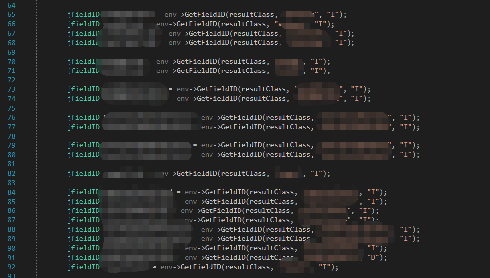
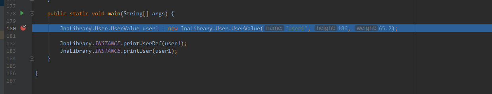
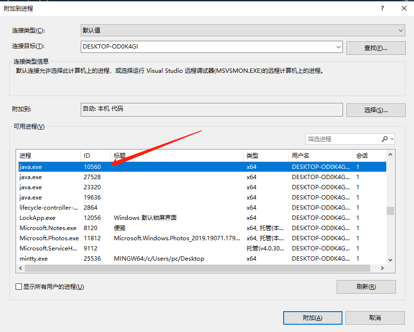
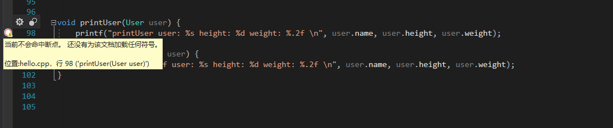
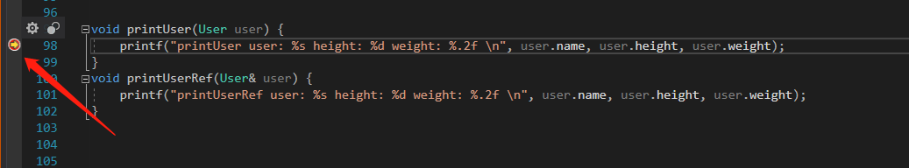
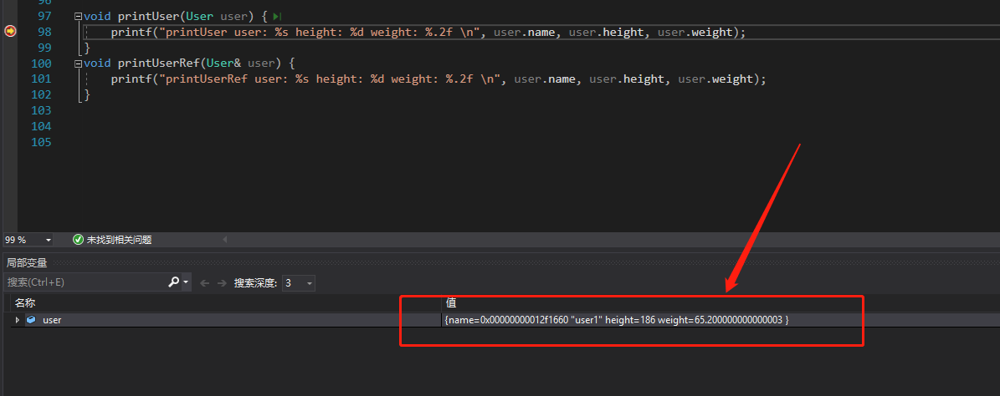

# JNA 教程

## 前言

只要你用过了 [JNA (java native access)](https://github.com/java-native-access/jna) , 那你可能就再也不想用 JNI 了

实际上, JNA 搞定了 JNI 中最麻烦的数据类型映射, 可以让我们进行高效的开发,  不用再去写各种的转换接口. 
- char*
- string
- 数组
- 结构体

上面的数据类型它都支持

可能有人会问 JNA 能完全代替 JNI 么?  不能,  **JNA只能实现Java访问C函数**，如果你想实现C语言调用 Java 代码, 你还是需要使用 JNI 技术。

但其实在很大程度上已经够用了, 因为在很多应用领域都是由 C++算法工程师提供库 (.so/.dll) ,  java 工程师只需要负责调用就可以了
## JNA 有什么用? 吹一波?

就一个 **简化 jni 开发**

想想当年写 jni 的时候, 下面这样的代码要写几百行, 你就知道我有多痛苦了 



当然最痛苦的还不是这个

在开发中, 作为一个JAVA 程序员你会遇到各种各样奇葩的问题

还包含一部分你无法理解的C++问题

- 类型转换
- linux  windows多环境编译
- 内存泄漏
- 异常处理
- 各种找不到原因的报错
- debug 困难
- ...

而如果使用 JNA, 你可能只需要这样: 

- 你不需要通过 javah 生成头文件, 不需要给它写实现

- 不需要在 windows/linux 环境各自编译成 .dll/.so 来调用真正的函数
- 只需要声明一个接口, 其他的事情让 JNA 做好就行

```java
public class HelloWorld {
    public interface CLibrary extends Library {
        CLibrary INSTANCE = Native.load((Platform.isWindows() ? "msvcrt" : "c"), CLibrary.class);

        void printf(String format, Object... args);
    }

    public static void main(String[] args) {
        CLibrary.INSTANCE.printf("Hello, World\n");
    }
}
// 该源码来自 https://github.com/java-native-access/jna/blob/master/www/GettingStarted.md
```

## 哪些项目使用了 JNA 

- Apache Cassandra：大型NoSQL数据存储
- JetBrains的IntelliJ IDEA
- NetBeans IDE

...

每天都在用的 IDEA 都用了 JNA =.= 你还怕什么?

## 数据类型映射

了解一下 C -> java 的数据类型映射, 帮助你更好的完成之后的练习

| Native Type | Size                | Java Type  | Common Windows Types    |
| ----------- | ------------------- | ---------- | ----------------------- |
| char        | 8-bit integer       | byte       | BYTE, TCHAR             |
| short       | 16-bit integer      | short      | WORD                    |
| wchar_t     | 16/32-bit character | char       | TCHAR                   |
| int         | 32-bit integer      | int        | DWORD                   |
| int         | boolean value       | boolean    | BOOL                    |
| long        | 32/64-bit integer   | NativeLong | LONG                    |
| long long   | 64-bit integer      | long       | __int64                 |
| float       | 32-bit FP           | float      |                         |
| double      | 64-bit FP           | double     |                         |
| char*       | C string            | String     | LPCSTR                  |
| void*       | pointer             | Pointer    | LPVOID, HANDLE, LP*XXX* |

from  [JNA - Default Type Mappings](https://github.com/java-native-access/jna/blob/master/www/Mappings.md)

你可能会发现表中没有 native 的 boolean 类型, 默认上 `boolean = true` 会被默认映射成 ` -1(int)`, 在 C 中打印出来是 255.  所以我一般在定义接口时, 会避免使用 bool .   如果想自定义 boolean 映射, 可以参考 [JNA maps Java boolean to -1 integer?](https://stackoverflow.com/questions/55225896/jna-maps-java-boolean-to-1-integer) 

## 代码示例

本代码示例基于 **64位 win10 + vs 2019**

如果遇到 dll 依赖问题( UnsatisfiedLinkError ), 请下载 [ micro soft vc 运行库](https://support.microsoft.com/en-us/help/2977003/the-latest-supported-visual-c-downloads) 或者使用 [Dependency walker](http://www.dependencywalker.com/)  查看 dll 依赖缺失情况

可以 clone 一下我的项目:

java 部分:  https://github.com/giraffe-tree/jna-func 

c++ 部分(vs 项目):  https://github.com/giraffe-tree/jna-c

### max 

先来个简单的例子

先将下面的依赖加入你的 java maven 项目

```xml
<dependency>
    <groupId>net.java.dev.jna</groupId>
    <artifactId>jna</artifactId>
    <version>5.3.1</version>
</dependency>
```


```c++
// c++  需要在 vs 中编译成 dll
int max(int num1, int num2) {
	return num1 > num2 ? num1 : num2;
}
```

```java
// java
public interface JnaLibrary extends Library {
     // JNA 为 dll 名称
	JnaLibrary INSTANCE = Native.load("JNA", JnaLibrary.class);
	int max(int a, int b);
}
```


将编译好的  `JNA.dll`,  `JNA.lib` 放入 resources 文件夹下的 `win32-x86-64` 目录中 (我使用的是 64位 windows), JNA 会自动到 `win32-x86-64` 中去找 `JNA.dll`

运行 `main` 函数即可

```java
public static void main(String[] args) {
    int max = JnaLibrary.INSTANCE.max(100, 200);
    // out: 200
    System.out.println(max);
}
```

### primitive array

```java
 // java
public interface JnaLibrary extends Library {
     // JNA 为 dll 名称
	JnaLibrary INSTANCE = Native.load("JNA", JnaLibrary.class);
	void testArray(short[] vals, int len);
}
```

```c++
// c++
void testArray(uint16_t* vals, int len) {
	for (int j = 0; j < len; j++) {
		printf("vals[%d]: %d \n", j, vals[j]);
	}
}
```

```java
JnaLibrary.INSTANCE.testArray(new short[]{1, 2, 3, 4}, 4);
// out:
vals[0]: 1 
vals[1]: 2 
vals[2]: 3 
vals[3]: 4 
```

### 值传递与引用传递

通过值传递对象的时候需要注意

1. 对象需要继承 `Structure` , 且它的属性必须为 **public**
   - Structure fields corresponding to native struct fields *must* be public. If your structure is to have no fields of its own, it must be declared abstract.
2.  JNA 有时候会判断错误, 导致原本的值传递, 变成引用传递, 从而报出` Invalid memory access` 的异常, 这时候最好实现一下 `Structure.ByValue` 接口
   - https://java-native-access.github.io/jna/5.3.0/javadoc/overview-summary.html#structures
3. FieldOrder 需要按顺序写, 否则会报出 `Invalid memory access`

```java
// java
public interface JnaLibrary extends Library {
     // JNA 为 dll 名称
	JnaLibrary INSTANCE = Native.load("JNA", JnaLibrary.class);
	// 实际测试下来 void printUser(User.ByValue user); 也是可以的
    void printUser(User user);
    void printUserRef(User user);

@Structure.FieldOrder({"name", "height", "weight"})
public static class User extends Structure {

public static class UserValue extends User implements Structure.ByValue {

	public UserValue(String name, int height, double weight) {
        super(name, height, weight);
        }
	}

    public User(String name, int height, double weight) {
        this.name = name;
        this.height = height;
        this.weight = weight;
    }

        public String name;
        public int height;
        public double weight;
	}
}
```

```c++
// .h
struct User {
	char* name;
	int height;
	double weight;
};
void printUser(User user);
void printUserRef(User& user);

// cpp
void printUser(User user) {
	printf("printUser user: %s height: %d weight: %.2f \n", user.name, user.height, user.weight);
}
void printUserRef(User& user) {
	printf("printUserRef user: %s height: %d weight: %.2f \n", user.name, user.height, user.weight);
}
```

```java
JnaLibrary.User.UserValue user1 = new JnaLibrary.User.UserValue("user1", 186, 65.2);
JnaLibrary.INSTANCE.printUserRef(user1);
JnaLibrary.INSTANCE.printUser(user1);
// out:
printUserRef user: user1 height: 186 weight: 65.20 
printUser user: user1 height: 186 weight: 65.20
```

### Pointer

```java
// java
public interface JnaLibrary extends Library {
    // JNA 为 dll 名称
    JnaLibrary INSTANCE = Native.load("JNA", JnaLibrary.class);
	
    void testStruct(ArrInfo arrInfo);
    
    @Structure.FieldOrder({"vals", "len"})
        public static class ArrInfo extends Structure {
            public Pointer vals;
            public int len;

            public ArrInfo(Pointer vals, int len) {
            this.vals = vals;
            this.len = len;
        }
    }
}
```

```c++
// .h
struct ArrInfo
{
	uint16_t* vals;
	int len;
};
void testStruct(ArrInfo arrInfo);

// cpp
void testStruct(ArrInfo arrInfo) {
	for (int j = 0; j < arrInfo.len; j++) {
		printf("arrInfo[%d]: %d \n", j, arrInfo.vals[j]);
	}
}
```

```java
// java main test
int len = 3;
int shortSize = Native.getNativeSize(Short.class);
Pointer pointer = new Memory(len * shortSize);
for (int i = 0; i < len; i++) {
    pointer.setShort(shortSize * i, (short) i);
}
JnaLibrary.ArrInfo arrInfo = new JnaLibrary.ArrInfo(pointer, len);
JnaLibrary.INSTANCE.testStruct(arrInfo);
// out
arrInfo[0]: 0 
arrInfo[1]: 1 
arrInfo[2]: 2 
```


## 关于 JNA 调试

虽然 JNA 相比于  JNI 好用很多, 但我在使用的过程中还是遇到一些"坑"

这些 bug 常常很难直接找出, JNA 统一都报了一个 `Invalid memory access` , 导致我们找不到真正错误的原因. 这时候就需要调试了

我使用的开发环境是 IDEA + jdk8 + VS2019 

### 步骤

先简单讲下步骤, 具体图文可以看下面的实战

1. 通过 vs 编译 debug 版本的 dll , 放入 java 项目指定的目录下 (我这里是`resources/win32-x86-64/JNA.dll`)
2. 启动 java 程序, 停止在你指定的断点上
3. `jps -l` 找到 java 程序的 pid
4. 在 vs 中  `ctrl+alt+p` 附加到进程, 选择刚刚找到的 pid, 点击附加
   - 其实一般是最上面的那个 java 进程, 就是你刚刚运行起来的那个
   - 点击 `j` 可以快速查找
5. 在 vs 中设置一个断点
6. 在 idea 中继续debug, 它会跳到 vs 的debug 界面中
7. 在 vs 中点击继续就可以接着调试啦

### 实战

在 idea 中进入调试



在下图中, `jps -l` 找到 java 程序的 `pid = 10560`


在 vs 中  `ctrl+alt+p` 附加到进程, 选择刚刚找到的 pid, 点击附加



此时断点不会命中



接着在 idea 中点击继续, 然后回到 vs 界面, 我们发现 断点被触发了



查看局部变量



yeah, 调试完成 =.=

## 其他问题

### C++ 中 printf 控制台打印缺失

目前测试下来, 可能存在 java 主线程停止, 但 C++ print 缓存区未被清空/不输出的情况, 导致控制台打印内容缺失

在这种情况下, 请延长 java 主线程运行的时间.

### 在C++调试时, 遇到未加载 jvm.pdb

目前测试下来, 在 vs 中 debug 继续后会报出一个 `未加载 jvm.pdb` , 我确实没有找到这个文件

但还可以继续调试, 没啥大问题

不过什么时候来个调试 openjdk 想想应该蛮有趣的 哈哈

###  Invalid memory access

这个问题怎么说呢, JNA 好多地方都能报出这个错误, 我遇到这个错误时, 大部分都是我的java 参数 ->  C++ 参数的映射问题

包括参数类型写错, 顺序写错等, 仔细检查映射关系就能解决

### dll 兼容性问题

`java.lang.UnsatisfiedLinkError: 找不到指定的模块。`

这个错误我遇到过的情况分两种

1. 我调用的 dll 没有放进指定目录
   - 比如我的平台是 `win32-x86-64`, 但是没有放入这个目录中
   - 这种情况下, jna 会提示找不到指定目录的资源文件比较好解决
2. 我调用的 dll 依赖的其他 dll 没有找到
   - 这个情况, 我在 win10 下编译, 然后在 windower server 2012 上运行时遇到过
   - 通过解决方案是这样 
     1. 通过 [Dependency walker](http://www.dependencywalker.com/)  查看 dll 依赖缺失情况
     2. 补全缺失的  dll
   - 当时我的情况是 缺失了 vc140, 然后我下载 [ micro soft vc 运行库](https://support.microsoft.com/en-us/help/2977003/the-latest-supported-visual-c-downloads) 就解决了这个问题
