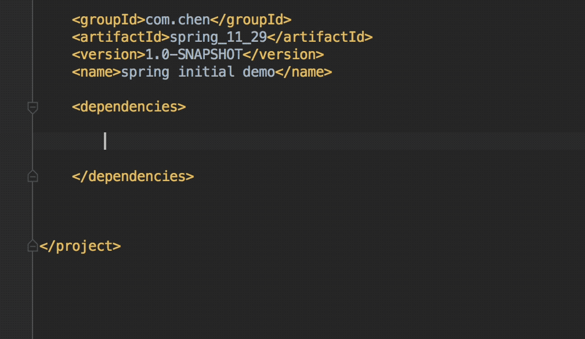

# Maven

主要参考来自:许晓斌的 maven实战

## 第三章 maven 使用入门


 如果不声明依赖的范围,那么默认就是 compile



 
- mvn clean compile 形成classes
- mvn clean test 测试 
- mvn clean package 打包

	- 借助 shade-plugin 将类信息添加到 manifest 中

- mvn clean install 把 jar 包放入本地仓库

	- 根据 groupId,artifactId 放入本地仓库

- java -jar 
 
 	- 执行```java -jar target/spring_11_29-1.0-SNAPSHOT.jar```

- mvn archetype:generate 
	
	-  产生 maven 原型


### 使用 eclipse 

在 eclipse 中安装 m2elcipse

当需要的命令没有时,使用 ```run as maven build```

在 ```goals```中输入命令就可以了,这里需要省去```mvn```

例如:
	
> 我们仅仅需要在 ```goals```中输入```clean test```就可以了

## 第五章 坐标和依赖

### 坐标

- groupId: 一般与域名反向一一对应
- artifactId: 项目名-模块名  如 spring-core
- version: 0.0.1 snapshot 快照版本,说明项目还在开发,属于不稳定版本
- packaging : 默认为 jar ,可以为 war
- classifier: 附属构件 (不能直接定义,要插件帮助完成)


### 依赖范围

依赖范围是用来控制依赖和三种 classpath 的关系

三种 classpath:

- 编译 classpath
- 测试 classpath
- 运行 classpath

五种依赖范围

- compile : 三种 classpath 均可用
- test : 仅测试 classpath 可用 ----Junit
- provided : 在编译和测试有效,----servlet.api, 在运行时容器已经提供,固不需要 
- runtime : 仅在测试,运行时有效 ---- jdbc
- system : 系统依赖,在编译和测试有效,通过 systemPath 元素指定依赖文件路径
- import : 导入依赖范围

### 传递性依赖


### 依赖调解

依赖调解有两个原则:

1. 路径最近者优先
2. 当路径长度一致,第一声明者优先

### 可选依赖

 假如: A项目中使用了可选依赖,B 项目依赖 A, 则 A 项目中的可选依赖不会传递给 B
 
 
```
        <dependency>
            <groupId>mysql</groupId>
            <artifactId>mysql-connector-java</artifactId>
            <version>6.0.6</version>
            <optional>true</optional>
        </dependency>

```

 一般项目中出现两个互斥的特性会出现这样的情况,如项目依赖了 mysql,postgresql 两个数据库的驱动库,但项目中只使用其中一个.
 
### 排除依赖
 
1. 你想替换一个传递性依赖
2. 你想升级一个传递性依赖的版本
 
	```
	 		<dependency>
	            <groupId>org.springframework</groupId>
	            <artifactId>spring-webmvc</artifactId>
	            <version>4.0.3</version>
	            <exclusions>
	                <exclusion>
	                    <groupId>org.springframework</groupId>
	                    <artifactId>spring-context</artifactId>
	                </exclusion>
	            </exclusions>
	        </dependency>
	 
	```
 
### 归类依赖

可以使用 ```properties ```来定义统一的版本


```	
 	<properties>
        <junit.version>4.12</junit.version>
    </properties>
	
    <dependencies>
        <dependency>
            <groupId>junit</groupId>
            <artifactId>junit</artifactId>
            <version>${junit.version}</version>
            <scope>test</scope>
        </dependency>
	
    </dependencies>
```

### 优化依赖

maven 会自动解析所有项目的直接依赖和传递性依赖,并且根据规则正确判断每个依赖的范围,对于一些依赖冲突也能进行调节,以确保任何一个构件只有唯一的版本在依赖中存在.在所有依赖解析,调节后,会得到一个列表----已解析依赖(Resolved Dependency)

你可以用```mvn dependency:list```查看已解析的依赖

```
[INFO] The following files have been resolved:
[INFO]    org.hamcrest:hamcrest-core:jar:1.3:test
[INFO]    junit:junit:jar:4.12:test
[INFO] 
[INFO] ------------------------------------------------------------------------
[INFO] BUILD SUCCESS
[INFO] ------------------------------------------------------------------------
[INFO] Total time: 6.623 s
[INFO] Finished at: 2017-11-30T22:30:08+08:00
[INFO] Final Memory: 16M/198M
[INFO] ------------------------------------------------------------------------

```

```mvn dependency:tree```查看依赖树

```
[INFO] --- maven-dependency-plugin:2.8:tree (default-cli) @ mavenDemo ---
[INFO] com.chen:mavenDemo:jar:0.0.1-SNAPSHOT
[INFO] \- junit:junit:jar:4.12:test
[INFO]    \- org.hamcrest:hamcrest-core:jar:1.3:test
[INFO] ------------------------------------------------------------------------
[INFO] BUILD SUCCESS
[INFO] ------------------------------------------------------------------------
[INFO] Total time: 1.503 s
[INFO] Finished at: 2017-11-30T22:31:46+08:00
[INFO] Final Memory: 12M/155M
[INFO] ------------------------------------------------------------------------
```

```mvn dependency:analyze``` 分析依赖树

它会告诉你,你在项目中使用了哪些可能有潜在风险的依赖

潜在风险的意思就是:

1. Used undeclared dependencies :  你可能使用了 A 依赖中的 B依赖,但是这个B依赖并没有显式声明, 它可能会因为A依赖的版本改变而改变,从而带来潜在的风险.

2. Unused declared dependencies: 你在 pom 文件中声明了这个依赖,但你的程序中却没有使用


