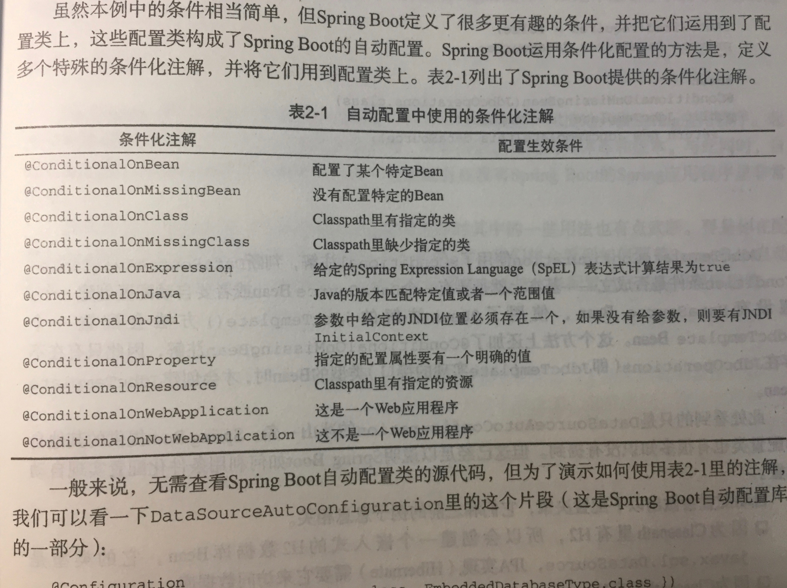

# SpringBoot

10点多了,看完 machine learning 第一章,想换换口味,拿了一本 **SpringBoot实战** 出来,2016年9月出版的.

这本书是我大学快毕业的时候,在学校旁边的二手书店买的,书是59块钱,打的四折,而且书还很新.但买回来才发现书是盗版书.希望作者原谅我吧.还好印刷还算可读,今天剩下的时间就读读这本书吧.

## 第一章 入门

### spring boot 核心

1. 自动配置

2. 起步依赖

3. 命令行界面

	> 这个我没有用过

4. Actuator 执行器

	> 为了检视应用程序内部情况,如以下细节:
	
		 spring 上下文中配置的 bean
		 spring boot 自动配置中做的决策
		 读取的环境变量,系统属性,配置属性,命令行参数
		 应用程序中线程的当前状态
		 最近处理过的 http 请求的追踪情况
		 各种内存用量,垃圾回收, web 请求,数据源用量的指标
	
#### spring boot 不是什么

1. springboot 不是应用服务器,只是嵌入了 tomcat 容器
2. springboot 没有实现 jpa,jms 等,只是自动配置了某个实现的 bean
3. springboot 利用了 spring4 条件化配置,从而实现自动配置

### 使用 spring initialzr

略


## 第二章 开发第一个应用程序

### springboot 基础知识

#### @SpringBootApplication

书上说结合了三个注解:

1. @Configuuration 表明该类使用 spring 基于 java 的配置
2. @ComponentScan 启用组件扫描
3. @EnableAutoConfiguration 开启 springboot 自动配置

#### 测试

@RunWith(SpringRunner.class)
@SpringBootTest

#### application.properties

可以删掉,不会影响最基本的 spring boot 应用

但是如果你要一些特定的配置,就需要加上这个文件,例如:```server.port=8080```,它可以修改内置 tomcat 的监听端口

#### dependency

你会发现在 项目的 pom 文件是依赖 ```spring-boot-starter-parent```

```
	<parent>
		<groupId>org.springframework.boot</groupId>
		<artifactId>spring-boot-starter-parent</artifactId>
		<version>1.5.9.RELEASE</version>
		<relativePath/> <!-- lookup parent from repository -->
	</parent>
```

你会发现在 项目的 pom 文件中的```dependencies``` 依赖都是没有版本号的,如:

```
	<dependency>
		<groupId>org.springframework.boot</groupId>
		<artifactId>spring-boot-starter-web</artifactId>
	</dependency>

	<dependency>
		<groupId>org.springframework.boot</groupId>
		<artifactId>spring-boot-starter-test</artifactId>
		<scope>test</scope>
	</dependency>
```

原因在于 ```spring-boot-starter-parent``` 中为你的 springboot 项目提供了版本管理,它会给你提供依赖版本号,并且保证 jar 包之间相互兼容

当你需要使用不同与 ```spring-boot-starter-parent``` 提供的版本时,直接大胆地在你的 pom 文件中加上吧. 不要担心冲突,因为你写的依赖会自动覆盖```spring-boot-starter-parent``中的依赖版本号

另外,当你不需要 springboot starter 组件中的某个 jar 时,你可以主动的去除它,如:

```
		<dependency>
			<groupId>org.springframework.boot</groupId>
			<artifactId>spring-boot-starter-web</artifactId>
			<exclusions>
				<exclusion>
					<groupId>com.fasterxml.jackson.core</groupId>
					<artifactId>jackson-core</artifactId>
				</exclusion>
			</exclusions>
		</dependency>
```


#### spring boot plugin

你会发现在起初的 spring boot 项目的 pom 文件中有这样一段:

```
<build>
		<plugins>
			<plugin>
				<groupId>org.springframework.boot</groupId>
				<artifactId>spring-boot-maven-plugin</artifactId>
			</plugin>
		</plugins>
	</build>
``` 

这是一个构建插件,主要功能是把项目打包成一个可执行的 jar ,可以我们用 ```java -jar 项目名.jar``` 执行


## 第三章 自定义配置

关于 conditional注解的配置




