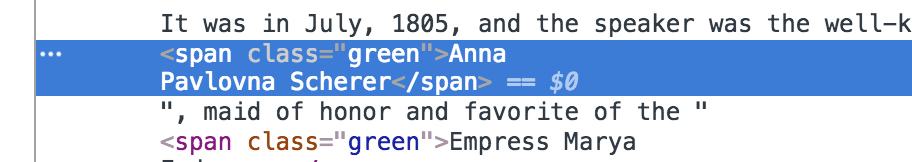
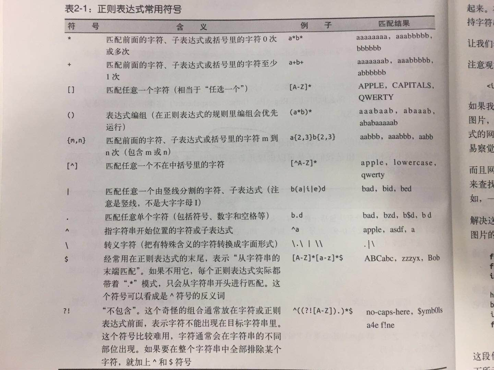
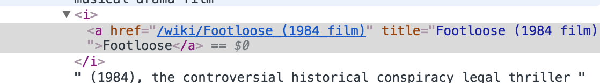

# Python Scraping 

**主要内容来自图灵出版的 "python 网络数据采集"**

**该书的源码github网址:** [REMitchell/python-scraping](https://github.com/REMitchell/python-scraping)

**以下是我的个人总结:**

我的代码在这里: [github.com/cc19941109/PythonDemo](https://github.com/cc19941109/PythonDemo/tree/master/com/chen/python_scraping)

## 第一章 初见网络爬虫

### 获取 html 标签内容

```
from urllib.request import urlopen
from bs4 import BeautifulSoup

html = urlopen("http://pythonscraping.com/pages/page1.html")
bsObj = BeautifulSoup(html.read())

print(bsObj.h1)

print(bsObj.html.body.h1)
```

### 你可能会遇到的问题

Q1. 

```
No parser was explicitly specified, so I'm using the best
available HTML parser for this system ("html.parser"). This usually isn't a
problem, but if you run this code on another system, or in a different
virtual environment, it may use a different parser and behave differently.

To get rid of this warning, change this:

 BeautifulSoup([your markup])
```

> **使用**: ```bsObj = BeautifulSoup(html.read(),"html.parser")```
> 
> **参考**: [How to get rid of BeautifulSoup user warning?](https://stackoverflow.com/questions/33511544/how-to-get-rid-of-beautifulsoup-user-warning)


Q2.

你可能会发现,使用形如```bsObj.h1```这类的操作,仅仅会找到页面中的第一个标签,而其他标签都被遗漏了.那么,如何找到所有的标签信息呢?

我们可以使用```findAll(...)```,不过具体的使用我们之后再讲


### 处理常见的异常

我们会遇到的异常:

1. 当我们访问网站失败时的异常会出现```HTTPError/URLError```

	- ```HTTPError```是```URLError```的子类，它抛出的异常是更为具体地指向HTTP URLs,可以通过```e.code```获取状态码
	- 参考:[关于URLError和HTTPError](http://blog.csdn.net/whd526/article/details/52279103)

2. 当获取节点失败时,会有```AttributeError```

下面是案例:

```
from urllib.request import urlopen
from bs4 import BeautifulSoup
from urllib.error import HTTPError, URLError


def getTitle(url):
    try:
        html = urlopen(url)
    except (HTTPError, URLError) as e:
        # print(e.code)
        return None
    try:
        bsObj = BeautifulSoup(html.read(), "html.parser")
        title = bsObj.body.h1
    except AttributeError as e:
        return None
    return title


title = getTitle("http://pythonscraping.com/pages/page1.html")

if title == None:
    print("title could not be found")
else:
    print(title)

```


## 第二章 复杂 HTML 解析

### 如何处理复杂的网页

当我们遇到一些复杂网页时,往往会产生一长串的获取节点的代码, 而且当网站修改节点时,我们的爬取程序也要重新写过.那我们应该怎么做呢?


#### 去除标签信息

当我们获取上面示例程序的 title ,会有一个烦人的点,就是标签中的```<h1></h1>```始终保留,那么怎么去除它们呢? 

很简单,使用``` get_text()```方法

如```title.get_text()```

但是需要注意的是,当我们处理数据的时候,应当尽量保留数据中的节点信息,以备之后使用,仅当你需要打印/存储/操作数据时,再去除标签信息

#### 使用 find/findAll

find 

```
def find(self, name=None, attrs={}, recursive=True, text=None,
             **kwargs)
```

findAll

```
def find_all(self, name=None, attrs={}, recursive=True, text=None,
                 limit=None, **kwargs)
```

#### 属性介绍

- recursive: 若为 True, 则方法会去查找所有的子标签;若为 False 则只查找一层标签
- text : 匹配为标签中的文本,必须完全匹配,否则不起作用. 默认 True
- limit : 只有 findAll 有, 限制返回的个数

#### 示例

如查找下面的所有标签:



```
from urllib.request import urlopen
from bs4 import BeautifulSoup

html = urlopen("http://www.pythonscraping.com/pages/warandpeace.html")
bsObj = BeautifulSoup(html,"html.parser")


list1 = bsObj.findAll("span",{"class":"green"})

for obj in list1:
    print(obj.get_text())

```

### 子标签和后代标签

子标签是父标签的下一级标签

后代标签是父标签下面所有的标签,包括子标签,子标签的子标签....

例如:

```
html = urlopen("http://www.pythonscraping.com/pages/page3.html")
bsObj = BeautifulSoup(html, "html.parser")

for child in bsObj.find("table",{"id":"giftList"}).children:
    print(child)

# for obj in list1.children:
#     print(obj)

print("\n- -- - -- - -- - -\n")

for descendant in bsObj.find("table",{"id":"giftList"}).descendants:
    print(descendant)

```

### 兄弟标签

```
from urllib.request import urlopen
from bs4 import BeautifulSoup

html = urlopen("http://www.pythonscraping.com/pages/page3.html")
bsObj = BeautifulSoup(html, "html.parser")

# sibling 兄弟姐妹

for sibling in bsObj.find("table",{"id":"giftList"}).tr.next_siblings:
    print(sibling)


```

### 父标签


```
from urllib.request import urlopen
from bs4 import BeautifulSoup

html = urlopen("http://www.pythonscraping.com/pages/page3.html")
bsObj = BeautifulSoup(html, "html.parser")

x = bsObj.find("img", {"src": "../img/gifts/img1.jpg"}).parent.previous_sibling.get_text()

print(x)

```


### 正则表达式

最经典的用途就是,识别邮箱地址

具体用途如下图:




### 正则表达式与 BeautifulSoup

示例:

```
rom urllib.request import urlopen
from bs4 import BeautifulSoup
import re

html = urlopen("http://www.pythonscraping.com/pages/page3.html")
bsObj = BeautifulSoup(html, "html.parser")

x = bsObj.findAll("img", {"src":re.compile("\.\.\/img\/gifts\/img.*\.jpg")})

for img in x :
    print(img.attrs)
    print(img["src"])
```


### 用 lambda 表达式

示例:

```
from urllib.request import urlopen
from bs4 import BeautifulSoup

html = urlopen("http://www.pythonscraping.com/pages/page3.html")
bsObj = BeautifulSoup(html, "html.parser")

x = bsObj.findAll(lambda tag:len(tag.attrs)==2)

for obj in x :
    print(obj.attrs)

```

## 第三章 开始采集


### 采集 kevin_Bacon 的 wiki

首先,看看下面的示例

目的是找出所有的跳转词条的 url



```
from urllib.request import urlopen
from bs4 import BeautifulSoup

html = urlopen("http://en.wikipedia.org/wiki/Kevin_Bacon")
bsObj = BeautifulSoup(html, "html.parser")

for link in bsObj.find("a"):
    if 'href' in link.attrs:
        print(link.attrs['href'])

```


#### 你可能遇到的问题

```
<urlopen error [SSL: CERTIFICATE_VERIFY_FAILED] certificate verify failed 
```

**解决办法:**由于我是在 mac 上运行的,我只需要执行```/Applications/Python\ 3.6/Install\ Certificates.command```这个文件就可以解决这个问题

1. 具体的原因参见下面引自 Stack Overflow的参考.
2. 另外在```/Applications/Python\ 3.6/ReadMe.rtf ```中也提到了这个问题.

参考:[urllib and “SSL: CERTIFICATE_VERIFY_FAILED” Error
](https://stackoverflow.com/questions/27835619/urllib-and-ssl-certificate-verify-failed-error)


#### 改进

另外,我们发现其实很多的链接对于我们都是没有用的,那怎么办呢

```
from urllib.request import urlopen
from bs4 import BeautifulSoup
import re

html = urlopen("http://en.wikipedia.org/wiki/Kevin_Bacon")
bsObj = BeautifulSoup(html, "html.parser")

for link in bsObj.find("div",{"id":"bodyContent"}).findAll("a",href = re.compile("^(/wiki/)((?!:).)*$")):
    if 'href' in link.attrs:
        print(link.attrs['href'])

```


### 总结一下如何使用 urllib 进行爬虫

1. 爬取的一般是 html 元素
2. 我们通过 ```urllib.request.urlopen("你要爬的网址")```

	> 这里返回的其实是一个上下文管理器的对象
	
	> This function always returns an object which can work as a context
    manager 


3. 再通过 BeautifulSoup 处理这个对象 ```bsObj = BeautifulSoup(html, "html.parser")```,返回一个 BeautifulSoup对象

4. 这时候,我们可以通过 ```find/findAll``` 方法来进行查找

5. 常用的方法是使用正则表达式

	```
	# 你需要导入 re 包 import re
	bsObj.find("div",{"id":"bodyContent"}).findAll("a",href = re.compile("^(/wiki/)((?!:).)*$")
	```
6. 找到链接后,你可以取找各种你想获取的信息


